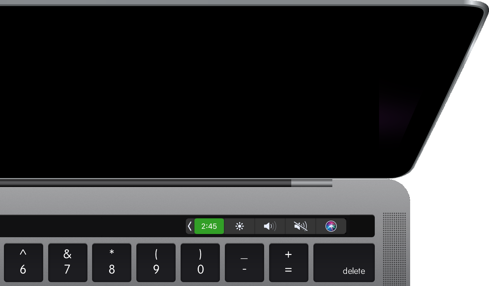

# Touch Bar Timer

A little stopwatch for your Mac's touch bar.

* **Tap** to start/stop.
* **Double-tap** to reset.
* **Hold to open** the app preferences.

[touch-bar-timer.alexzirbel.com](https://touch-bar-timer.alexzirbel.com/)

Forked from [Mute Me](https://github.com/pixel-point/mute-me) by [Pixel
Point](https://muteme.pixelpoint.io/).

## Contributing

Contributions are welcome!

Please open an issue to discuss proposed changes, rather than opening a pull
request directly.

## Development

Use Xcode.

## Website Repo

[touch-bar-timer-website](https://github.com/azirbel/touch-bar-timer-website)

### Releasing

1. Xcode Product > Archive
2. Export
3. Release with Developer ID
4. Automatically manage signing
5. Export
6. Use https://github.com/sindresorhus/create-dmg to create a DMG
7. Upload DMG to touch-bar-timer-website

## Copyright & License

Copyright (c) 2018 Alexander Zirbel - Code released under the [MIT
license](LICENSE).
